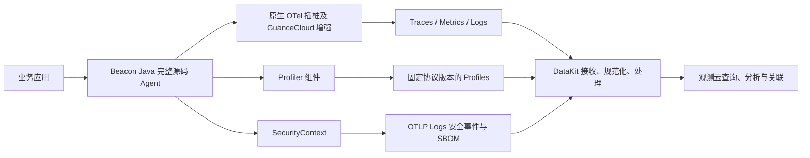
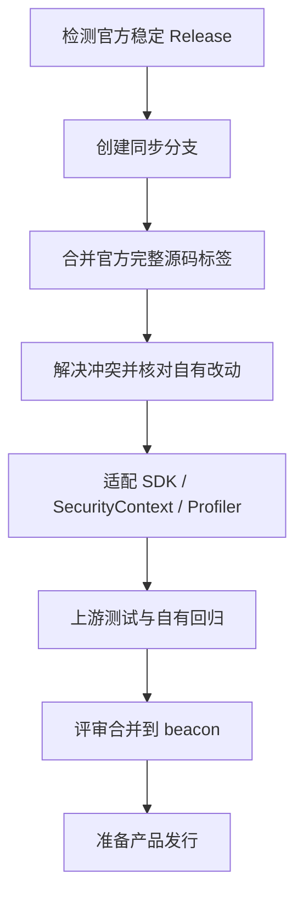
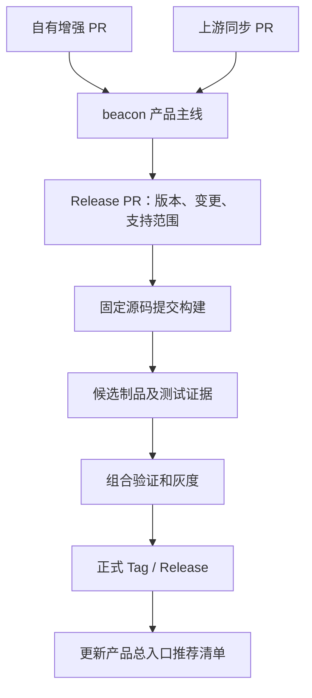

# Beacon 完整解决方案

版本：方案 v1.0 · 日期：2026-09-20 · 适用组织：GuanceCloud

状态：内部评审稿。本文定义产品、技术、工程和交付方案；没有创建或修改远程仓库，没有发布软件，也没有以文档审查代替运行验收。

本文以最新明确的需求为准：**Beacon Java 维护完整 OpenTelemetry Java Instrumentation 源码，支持增强原生插桩，持续合并官方更新，并发行自己的版本。** 此前仅下载官方 Agent 再组装扩展的方案不再作为主路线；独立扩展仍可用于 SecurityContext 等职责明确的组件。

## 1. 决策摘要

Beacon 是 GuanceCloud 基于 OpenTelemetry 的应用探针发行体系。统一品牌、支持矩阵、数据关联和发布规范，按语言独立开发与发版，通过 DataKit 接入观测云。

| 议题 | 本方案建议 |
| --- | --- |
| 技术路线 | Java 采用完整源码的下游发行版，可修改原生 instrumentation 和 Agent 实现 |
| 产品入口 | `GuanceCloud/beacon`：产品文档、多语言版本组合、兼容矩阵和跨组件验收 |
| Java 工程 | `GuanceCloud/beacon-java`：完整源码、自有增强、上游同步、Java 发行 |
| GitHub 托管方式 | 推荐新建普通空仓库并导入现有完整 Git 历史；不显示 Fork 标记也可以进行源码同步 |
| 旧仓库 | `opentelemetry-java-instrumentation` 保留历史与约定的存量支持；明确新功能权威入口转到 beacon-java |
| 上游同步 | 合并官方发布标签；保留共同历史和 merge ancestry，不用源码目录覆盖或 ZIP 重建 |
| 外部组件 | SecurityContext、Profiler 保持明确源码归属，固定版本后集成 |
| 接收与平台 | DataKit 接收、处理、分流；观测云负责查询、关联与展示 |
| 版本 | Beacon 产品版本、语言组件版本、OTel 基线、增强组件版本分别记录 |
| 首期推进 | Java 做完整验收样板；Go/Python 在同一体系内按真实能力推进，不默认与 Java 等价 |
| 正式发布 | 必需能力、运行矩阵、DataKit 联调、灰度和回退均通过后发布固定制品 |

建议对外介绍：

> Beacon 是观测云基于 OpenTelemetry 打造的应用探针发行体系，在标准遥测能力之上提供原生插桩增强，并按语言和运行环境集成持续性能剖析、安全上下文与运行时依赖信息，帮助用户关联分析应用调用、代码性能和运行时行为。

“Unified Telemetry Instrumentation Runtime”可作为长期技术定位；首发说明必须同时给出可验收的功能和平台范围。

## 2. 依据、现状与待确认项

### 2.1 已核对的事实

| 事实 | 对方案的影响 |
| --- | --- |
| 原始讨论提出 Beacon 品牌，要求整理打包、文档，整合 Profiling 和 Security Context 后发布 1.0 | 首期同时包含工程集成与产品交付，不能仅替换包名 |
| 已有 Java 官方 Fork，存在 guance、guance-v2、async-profile 等分支 | 先审计生产基线和自有差异，复用已有成果 |
| 本次读取 guance-v2 提交为 `73a8f7edd0415f0e8651d3d1f3f295e6e6d4d1ea`，版本配置为 2.30.2 | 这是下游代码快照，不自动等于已确认的官方祖先标签 |
| 已读取的 SecurityContext 提交为 `2c45b64267987f6deefa43159f06f928c6974177` | 安全能力评估可以使用确定源码快照 |
| 该 SecurityContext Java 为 0.3.4，编译依赖 Agent Extension API 2.31.1-alpha、SDK 1.65.0 | 与当前 Java 下游 2.30.2 存在基线差异，需要先适配或升级验证 |
| SecurityContext 文档列出 Java、Node.js、Python，未列出 Go | Go 安全能力不能随品牌统一而默认标成已支持 |
| SecurityContext 文档明确仍是原型，历史测试不代表当前完整发布验收 | 进入 Beacon GA 需要额外兼容、性能和交付验证 |
| DataKit 公开树中存在 OTel 与 Profile 接收模块 | 仅证明存在相关实现，不能证明目标 OTLP Profiles/安全分流已完成 |
| 现有 Java 自定义发布工作流面向 guance-v2，继承的 SDK 自动更新流程面向 main | 需要重建一致的上游同步、产品主线与发布入口 |

本次对 `GuanceCloud/beacon-java` 的 API 查询返回 404，只能说明当前访问上下文未读到该仓库，不能排除不可见私有仓库。因此，下文使用“目标仓库”描述，实施前先确认是否已存在。

代码、版本和测试范围以固定提交为准；公开 DataKit 仓库与内部开发状态可能不同。本文未完成源码全量差异审计和实际联调。

主要依据：[原始需求讨论](https://guanceyun.feishu.cn/wiki/Timvwx0YciSNqqkTnBgcRLc8nQC)、[Java 快照](https://github.com/GuanceCloud/opentelemetry-java-instrumentation/tree/73a8f7edd0415f0e8651d3d1f3f295e6e6d4d1ea)、[SecurityContext 快照](https://github.com/GuanceCloud/SecurityContext/tree/2c45b64267987f6deefa43159f06f928c6974177)。

### 2.2 尚需在第一个里程碑确定

1. Java 现有哪一条分支、哪些功能属于生产维护基线。
2. 首版采用的官方 OTel 标签，以及 SecurityContext/Profiler 的兼容组合。
3. 1.0 对外正式支持的语言、JDK、框架、OS、架构和 Profile 类型。
4. DataKit 安全事件落点、SBOM 处理职责与平台展示接口。
5. 新仓库普通导入或现有 Fork 重命名的最终选择、公开范围和负责人。

这些是实施决策项，不阻止先完成差异盘点和验证样例。正式发布前必须关闭相关决策，不能用“待确认”作为支持承诺。

## 3. 产品范围与版本边界

### 3.1 1.0 的能力目标

| 能力 | 首版要求 | 验收证据 |
| --- | --- | --- |
| 标准遥测 | 保留选定上游基线中声明支持的 Traces/Metrics/Logs 能力 | 框架与运行时矩阵、数据结果 |
| 原生插桩增强 | 迁移并验证必要的 GuanceCloud 自有增强 | 自有功能清单和回归用例 |
| Profiling | 至少完成产品声明范围内的采集、传输、展示和关联 | Profile 样例、平台查询、性能报告 |
| Security Context | 支持范围内的安全数据流观察、上下文和诊断事件 | 正负例、Schema、投递和关联测试 |
| 运行时依赖/SBOM | 识别并展示真实可观察范围和完整性状态 | 快照、分片、修订与缺失处理测试 |
| 统一发行 | 固定版本安装、配置、升级、回退和来源可追溯 | 制品、校验文件、支持矩阵、操作记录 |

Logs 要分别描述日志关联、框架日志导出和文件日志采集；不能将“支持 OTel Logs”解释为自动采集所有应用文件。安全上下文观察也不等于完整漏洞扫描或攻击阻断。

### 3.2 语言推进策略

| 语言 | 当前建设基础 | 建议首期工作 |
| --- | --- | --- |
| Java | 完整 OTel Fork、SecurityContext Java、Profiling 相关仓库 | 优先完成完整源码发行和全链路验收 |
| Python | OTel contrib Fork、SecurityContext Python | 盘点 gtrace 分支、确定核心 SDK/自动加载/Profiler 组合 |
| Go | 编译期插桩 Fork、OTel SDK 相关仓库 | 选择编译插桩或 SDK 路径，单独验证工具链与 Profiling；安全能力另评估 |
| Node.js | OTel JS contrib 与 SecurityContext Node.js | 可列入后续语言扩展，不因现有安全实现而自动扩大 1.0 范围 |

建议先以 Java 达到完整 GA 门槛，再扩大其他语言的正式支持。如果产品决定 Java/Go/Python 必须同时 GA，则三种语言分别通过同等交付门槛后才能宣告该范围的 1.0；不得把缺失项默认为支持。

### 3.3 首期不承诺

跨所有语言零代码接入、全部框架安全覆盖、任意请求到 Profile 精确关联、无重启热升级、统一远程控制平台、自动攻击阻断和 AI Agent 自动执行修复，均不作为本方案首期默认承诺。

## 4. 系统架构与分工



| 层 | 负责 | 不在该层承担 |
| --- | --- | --- |
| Beacon | 应用插桩、运行时数据生成、上下文、预算及导出 | 平台存储、用户查询和跨租户权限 |
| DataKit | 接收、验证、字段处理、路由、缓存/重试及质量诊断 | 凭日志字符串猜测漏洞或伪造请求关联 |
| 观测云 | 存储、服务与代码视图、Profile、安全事件和依赖信息关联 | 把未知、未采样或缺片当成完整数据 |
| 发行体系 | 固定源码和组件、测试、制品、兼容矩阵 | 在客户启动时自动拼装浮动版本 |

标准 Traces/Metrics/Logs 采用约定版本的 OTLP。Profiles 按选定 Profiler 和 DataKit 实际支持的编码、路径和版本固化，不能因品牌使用 OTel 就假定所有 Profile 都已有稳定 OTLP 支持。官方当前仍将 Profiles 协议列为开发状态，应设置专门兼容门禁。[OTel 规范状态](https://opentelemetry.io/docs/specs/status/)

## 5. 仓库体系与代码归属

```text
GuanceCloud/
├── beacon                           # 产品总入口、组合版本、跨语言验收
├── beacon-java                      # 完整源码 Java 下游发行工程
├── beacon-python                    # 按 Python 实施阶段建立或迁移
├── beacon-go                        # 按 Go 实施阶段建立或迁移
├── SecurityContext                  # 跨语言安全能力与契约的权威源码
├── datakit                          # 接收与数据处理
└── opentelemetry-java-instrumentation # 旧源码入口与约定的存量维护
```

Python、Go 名称是目标规划，不表示已创建，创建前先确认现有仓库复用策略。无需在第一天建齐所有仓库。

### 5.1 beacon 产品仓库

维护品牌说明、语言选择入口、产品发布说明、组件映射、兼容矩阵、完整演示与跨组件验收。引用语言仓库的固定版本，不复制语言源码。

### 5.2 beacon-java 工程

保留上游 `instrumentation/`、`javaagent/`、`javaagent-tooling/`、构建脚本和测试设施。新增 `beacon/` 用于产品版本、基线、补丁台账、发行配置与文档。

不批量重命名 `io.opentelemetry.*`，不做全仓格式替换。现有原生插桩直接在原模块增强，新增框架按上游约定增加模块。自有独立代码可用 GuanceCloud 命名空间。

SecurityContext 可继续通过扩展或明确模块接口集成，并不意味着 Beacon 只能做扩展。完整源码中修改原生能力和组合独立增强组件可以同时存在。

### 5.3 OTel 源码范围

完整源码指 `opentelemetry-java-instrumentation` 工程。Java SDK 源码在独立的 `open-telemetry/opentelemetry-java` 仓库，通常以依赖接入。如果需要修改 SDK 内部，另建受控维护线并记录制品；不为了“完整”将所有 OTel 项目无差别复制进 Java Agent 仓库。

## 6. 仓库初始化与迁移

### 6.1 推荐路径：新建普通仓库并导入历史

1. 检查目标 `GuanceCloud/beacon-java` 是否已存在及是否为空。
2. 如需新建，创建普通仓库，不初始化 README/License，先禁用或审查自动工作流。
3. 从现有 Java 仓库 bare clone，完整导入所需分支、标签及其提交历史；不用浅克隆或 ZIP 重建。
4. 若使用 LFS，另迁移 LFS 对象。Release 附件、Issues、PR 和设置不随 Git 自动迁移。
5. 核对分支和标签 SHA；旧仓库标签可能是下游版本，不能自动认定为官方基线。
6. 从审计确认的生产提交创建 `beacon` 产品分支，再设置默认分支与保护规则。
7. 配置 `origin=GuanceCloud/beacon-java`、`upstream=官方仓库`；该本地配置不会创建 GitHub Fork 标记。
8. 更新文档、构建、制品地址和机器人配置，完成一次构建验证后才切换推荐入口。

GitHub 官方支持创建非 Fork 仓库并复制 Git 历史；本方案建议对确认空目标显式推送分支和标签，不把定期镜像覆盖作为产品同步机制。[仓库复制说明](https://docs.github.com/en/repositories/creating-and-managing-repositories/duplicating-a-repository)

另一条可选路径是直接重命名已有 Fork，可保留更多仓库资产，但需要评估旧入口和 Action 引用。两条路径由负责人在迁移前选定，不同时维护两个新功能主线。

### 6.2 迁移后责任

- 新功能、原生增强和上游同步以 beacon-java 为唯一主入口。
- 旧仓库只维护明确承诺的历史线，必要修复通过可追溯 backport 同步。
- 不立即删除或归档旧仓库；先完成消费者迁移及支持周期确认。
- 保留许可证、NOTICE 和来源说明；独立品牌不等于取消上游归属。

### 6.3 分支和标签

| 名称 | 用途 |
| --- | --- |
| `beacon` | 产品集成主线 |
| `feature/*` | 原生增强与自有功能 |
| `sync/otel-*` | 一次官方版本合并 |
| `release/1.x` | 有支持承诺时才建立的旧版本线 |
| `beacon-v1.0.0` | 自有发行标签；示例，不表示已发布 |
| `refs/upstream-tags/*` | 本地/CI 获取官方标签的独立引用空间 |

既有 main、guance、guance-v2 等先保留并标记用途。共享分支不重写历史，发行 tag 不移动或复用。

## 7. Java 原生插桩开发规范

### 7.1 增强分类

| 修改 | 代码位置/做法 | 必需测试 |
| --- | --- | --- |
| 现有 HTTP/JDBC/框架增强 | 在对应原生模块修改，避免复制第二套同时插桩 | 原有行为、增强行为、重复 Span、异常路径 |
| 新框架或协议 | 遵守上游模块和注册约定，加入构建 | 版本边界、类加载、开启关闭和上下文 |
| Agent 内部增强 | 限制影响范围，单独设计评审 | 启动、隔离、性能、异常与关闭 |
| 默认配置与品牌 | 产品配置、发行元数据 | 优先级、兼容和可诊断性 |
| SecurityContext/Profiler | 保持组件归属，固定版本集成 | 组合行为、冲突、投递和资源预算 |

不以新增逻辑覆盖所有现有默认行为；每项变化明确是否改变用户输出。官方的 InstrumentationModule、Advice/helper、SPI、类加载和 Muzzle 规则按实际采用标签执行。[原生插桩开发指南](https://github.com/open-telemetry/opentelemetry-java-instrumentation/blob/main/docs/contributing/writing-instrumentation-module.md)

### 7.2 自有改动台账

每项修改分配 ID，记录负责人、涉及模块、预期行为、关键提交、回归用例、上游 PR 和移除条件。上游已有等价实现时，在验证语义一致后删除本地重复逻辑，保留回归用例。

建议维护 `beacon/changes.yaml`，代码评审要求与功能同步更新。台账不替代 Git；每次升级仍通过 merge 保留原有提交。

### 7.3 配置策略

标准能力保留 `OTEL_*` 和上游支持的系统属性。Beacon 新增配置使用自有命名空间，但先定义并实现后才能在文档中作为可用参数展示。

首版建议提供基础遥测、性能剖析、安全上下文三套明确配置示例，而非隐式全部开启。SecurityContext 当前配置默认开启安全与 SBOM，基础模式必须显式关闭这两个开关；这需要验证，不靠打包名称推断。

用户显式配置优先于发行默认值，沿用所选上游的真实配置优先级并编写测试。启动诊断展示生效的组件版本、功能状态与脱敏后的目标地址，不输出认证信息。

## 8. 持续同步 OTel 的工程流程



1. 每日检测官方版本，按目标 tag 去重任务；基线文件记录已采用的官方 tag 和 commit。
2. 稳定线优先合并官方发布标签；main 的预兼容单独运行，不自动进入正式发行。
3. 从当前 beacon 分支创建同步分支，获取官方标签到独立命名空间，核对真实提交后 merge。
4. 逐项解决冲突，不使用全局 ours/theirs。无文本冲突也要检查全部自有增强模块的上游行为变化。
5. 使用目标版本配套 SDK/Instrumentation API/构建配置，不随意拼装各自最新依赖。
6. 更新上游基线、自有改动台账、支持矩阵；适配 SecurityContext 和 Profiler。
7. 执行必需检查后评审；同步 PR 用保留祖先关系的合并方式，不 squash 整次上游合并。
8. 合并后确定的源码提交重新构建发行候选，并绑定最终测试结果。

### 8.1 首次基线统一

当前公开 guance-v2 的 2.30.2 与 SecurityContext 使用的 2.31.1 系列依赖不能直接视为兼容。建议优先评估把自有增强合并到官方 2.31.1 或评审选定的更新稳定基线，再验证组合；若暂时无法升级，则必须对旧基线适配安全组件并记录限制。

2.31.1 仅为已核对的候选基线，不是未经测试就采用的正式决定。正式选择以源码差异和完整测试结果为准。

### 8.2 跟进目标

建议内部目标：24 小时发现官方更新，2 个工作日得到首轮兼容结果，无阻塞时 7–14 天发行。严重安全修复优先评估并走快速验证。指标是运营目标，不等于无条件承诺最新版永远可直接发布。

阻塞必须有原因、负责人和复查时间；维护看板显示上游版本、已采用版本、落后时长、补丁数量和同步失败原因。

## 9. 数据契约、身份与关联

### 9.1 普通遥测

保留标准 OTLP 数据结构和上游语义。字段、指标单位、聚合 temporality、默认采样或语义约定发生变化时，都要检查 DataKit、查询、看板和告警影响。

统一管理服务名、命名空间、环境、服务版本、实例、容器/主机及代码版本；未知值保持未知，不用随机值冒充稳定业务身份。产品自身版本不能覆盖业务 `service.version`。

### 9.2 SecurityContext 契约复用

以 SecurityContext 仓库 schema v2 为权威定义。DataKit 建议按 scope、source、schema_version 和事件结构共同识别，不能仅靠正文关键词。

| 输入 | 路由目标（待平台接口评审） | 要点 |
| --- | --- | --- |
| 普通 OTel Logs | 日志通道 | 保留原有日志语义 |
| `source=security_context` | 安全观察/诊断通道 | 不把观察直接定性为漏洞 |
| `source=security_context_sbom` | 运行时依赖快照与诊断通道 | 快照与健康诊断分别处理 |
| 未知或不合法 Schema | 受控兜底与处理失败诊断 | 保留必要原始信息、限额、可追查 |

现有事件 body 是 UTF-8 JSON 字符串；处理时检查 body 与 attributes 中 source、事件名的一致性。冲突按解析异常处理，不静默取一方。正常事件与截断最小事件有不同必需字段，校验器必须支持契约中的合法降级形式。

现有 OTel envelope 的日志严重程度与 body 的风险分级是不同概念，平台不能直接把日志 INFO 映射成低风险。具体字段和事件约束以固定 Schema 为准。[SecurityContext schema v2](https://github.com/GuanceCloud/SecurityContext/blob/2c45b64267987f6deefa43159f06f928c6974177/docs/security-context-log-schema.md)

### 9.3 SBOM 快照处理

依赖快照使用 `app-dependencies-loaded`。该事件是运行时已观察依赖的传输表达，不等于完整 CycloneDX 文件，也不等于应用所有可能执行路径的依赖全集。

消费端按身份及同一 sbom_id/revision 聚合分片，处理重复、乱序、超时和大小上限。只有收齐并验证一份修订后才能替换可用快照；缺片保留上一份有效快照并展示不完整状态。旧修订不能覆盖新修订，按契约发送的完整空快照应能清空旧库存。

快照组装的容量、超时和持久化由接收/平台团队评审决定，不在首版默认把无限状态放入 DataKit 内存。

### 9.4 关联粒度

| 关联 | 实现要求 |
| --- | --- |
| 服务/实例级 | 建立 OTel Resource 与组件身份的显式映射，使用时间窗口和真实实例标识 |
| 请求级 | 只有存在有效 Trace/Span 上下文时才使用精确关联 |
| Profile | 采样支持请求上下文时才支持精确关联，否则标为实例与时间窗口关联 |
| 代码与依赖 | 版本、commit、组件引用和运行时依赖表达一致 |

SecurityContext body 的 instance_id 不自动等于 Resource 的 service.instance.id，不能直接合并。存在 trace_id 也不代表后端一定保留了 Trace，界面应能表达未采样、未接收或已过保留期。

安全事件独立于 Trace 采样管理；Trace 未保留不应自动丢弃有价值的安全观察。独立通道仍有明确的预算、限速和丢弃统计。

## 10. DataKit 与平台改造清单

| 工作包 | 改造内容 | 完成标志 |
| --- | --- | --- |
| 接收协议 | 固定 Agent/Profiler 与接收端协议和端点矩阵 | 合法输入可解析，版本不匹配可诊断 |
| 安全分流 | 按现有契约识别安全、SBOM、普通日志 | 正例准确分流，普通日志不误判 |
| 字段映射 | 服务、实例、Trace、风险和完整性字段 | 不丢关键语义，映射有契约测试 |
| 传输可靠性 | 队列、重试、限速、重复处理和关闭 | 不阻塞应用；丢失与重试可观察 |
| SBOM 消费 | 修订与分片验证、快照替换、缺片诊断 | 不把部分数据冒充完整库存 |
| 展示关联 | 服务→链路→代码/Profile→安全与依赖 | 明确关联粒度，未知状态可见 |
| 兼容迁移 | 旧探针与新 Beacon 并存输入 | 迁移窗口内不会破坏存量数据 |

先固定一套真实 DataKit + 平台版本完成联调，再写最低支持版本。本文不凭公开文件目录推断内部开发功能已上线。

验收应逐层取证：应用生成 → exporter 提交 → DataKit 接收 → 后端写入 → 查询可见。API emit 成功或本地文件存在均不能代替后端持久化确认。

## 11. 版本、制品与发行清单

### 11.1 四层版本模型

| 层次 | 例子 | 语义 |
| --- | --- | --- |
| 产品组合 | Beacon 1.0 | 一组通过跨组件验证的语言发行与接收组合 |
| 语言组件 | Beacon Java 1.0.0 | Java 组件独立发版 |
| 上游基线 | OTel Java Instrumentation 2.31.1 | 被完整合入的官方源码版本及提交 |
| 增强组件 | SecurityContext Java 0.3.4、选定 Profiler | 独立组件来源、版本与兼容记录 |

例子为设计说明，不表示 Beacon 已发布。Java 修复可独立发布，无需等待 Python/Go；产品总入口通过更新组合清单采纳新组件。

自有产品按用户可见影响使用 SemVer：兼容修复为 Patch、兼容新功能为 Minor、破坏配置/输出契约或删除承诺支持的运行时为 Major。不能直接复制上游版本级别作为产品变更级别。

保留上游构建依赖的真实版本逻辑，增加独立 `beaconVersion` 用于发行标签、最终包名和元数据。若发布修改过的 SDK 或 instrumentation 库，使用自有发布坐标/版本，不覆盖官方制品。

### 11.2 发布包

```text
beacon-java-<版本>/
├── beacon-java-agent-<版本>.jar
├── config/                        # 基础、Profiling、安全场景示例
├── release-manifest.json
├── SHA256SUMS
├── sbom/                          # Beacon 自身构建期 SBOM
├── licenses/
├── README.md
└── RELEASE_NOTES.md
```

客户应用的运行时 SBOM 与 Beacon 发行包的构建期 SBOM 是不同对象，分别标注用途。带原生 Profiling 库时，明确 OS、架构和必要运行条件；单 JAR 的形式不意味着所有平台都可用。

统一安装入口可以提供 stable/preview/nightly 渠道，但每次安装解析后必须落到固定版本和摘要。生产应用启动不动态下载 latest；回退用已保存的历史制品。

### 11.3 发行清单的内容

必须记录：产品和组件版本、Beacon tag/commit、官方 tag/commit、外部组件版本和摘要、实际依赖与构建工具、产物摘要、Schema、已验证运行矩阵、DataKit 兼容版本、测试报告及已知限制。

以下是字段示意，含 null 的评审模板不允许作为正式发行输入：

```json
{
  "schema_version": 1,
  "component": "beacon-java",
  "version": "1.0.0-rc.1",
  "status": "unvalidated",
  "source": {"repository": "GuanceCloud/beacon-java", "commit": null},
  "upstream": {
    "repository": "open-telemetry/opentelemetry-java-instrumentation",
    "tag": null,
    "commit": null
  },
  "components": [],
  "artifacts": [],
  "compatibility": {"verified_runtimes": [], "verified_datakit": []},
  "verification": {"report": null}
}
```

官方基线是源码历史来源，最终 Beacon JAR 摘要是本次构建输出；两者不能混为一个校验值。正式清单由构建结果生成并不可变保存，校验器拒绝缺失版本、摘要或必需验收报告。

## 12. CI/CD 与发布流程



### 12.1 工作流划分

| 工作流 | 触发 | 职责 |
| --- | --- | --- |
| upstream-watch | 每日、手动 | 发现官方新版本、去重并发起同步任务 |
| upstream-sync | 选定目标版本 | 获取源码并尝试合并；冲突保留给负责人处理 |
| verify | 功能/同步 PR | 编译、模块/框架检查、自有功能回归、契约 |
| integration | 候选或规定的 PR | JDK、DataKit、Profiler、安全与平台矩阵 |
| nightly | 定时 | 更广框架覆盖、上游 main 预兼容；不发布 stable |
| release-candidate | 确定提交 | 生成固定候选制品、清单、许可证和 SBOM |
| release | 受控发行入口 | 验证提交/摘要/报告匹配，发布同一制品 |
| product-index | 成功发行后 | 向 GuanceCloud/beacon 提交版本组合更新 PR |

### 12.2 关键门禁

- 不让同步机器人直接覆盖产品主分支或自动解决所有源码冲突。
- 必需检查绑定正确目标分支和实际候选提交。合并产生新提交时，发行候选使用合并后的提交验证。
- 发布阶段不再更新依赖、合入上游、修改源码版本或拉浮动组件。
- 构建镜像、Wrapper、依赖和发布 Action 使用可追溯版本，逐步启用完整依赖验证。
- 机器人使用 GuanceCloud 自有 GitHub App，权限限定到所需仓库；测试默认只读，发布才授予写权限。
- 检查机器人创建 PR 后 CI 是否实际执行。GitHub 对 GITHUB_TOKEN 触发后续事件存在限制或审批状态，不能靠假设串联工作流。

当前现有 Java 工作流应逐项评估复用：保留有价值的构建和测试逻辑，调整上游组织硬编码、机器人身份、分支、上传地址和产品版本；仅复制 YAML 不等于流水线已能工作。[GitHub 事件触发说明](https://docs.github.com/en/actions/how-tos/write-workflows/choose-when-workflows-run/trigger-a-workflow)

### 12.3 RC 与正式版

推荐从带最终版本号的确定提交构建内部候选，经过灰度后发布相同制品。若公开 RC 的 Manifest 写着 `1.0.0-rc.1`，转正式 `1.0.0` 时内容发生变化，必须重新构建并对最终制品验证，不能仅改文件名。

同版本发布重试必须幂等；已存在 tag/资产与本次内容不一致时停止。不得重写 tag 或静默替换已发布 JAR。

## 13. 测试和发布验收

完整源码增强后不再要求所有 class 与官方 Agent 字节一致。目标是：已承诺的官方能力保持兼容，自有增强按预期生效，变化可解释、可追溯。

### 13.1 分层测试

| 层次 | 必需内容 | 主要负责 |
| --- | --- | --- |
| 源码构建 | 固定环境构建、依赖解析、Agent Manifest 与打包完整性 | Java/发布 |
| 原生模块 | 正常、异常、异步、类加载、目标库边界和 Muzzle | Java |
| 上游对照 | 同基线官方 Agent 与 Beacon，解释所有预期差异 | Java/测试 |
| 自有增强 | 每项改动对应回归用例，防止同步后静默失效 | 功能负责人 |
| 运行时 | 声明支持的 JDK/框架/OS/架构实际运行 | 测试 |
| 数据链路 | Traces/Metrics/Logs/Profile、安全和 SBOM 的端到端结果 | DataKit/平台 |
| 可靠性 | 断网、队列满、限速、错误输入、恢复、关闭与 flush | 组件/测试 |
| 性能 | 无探针、基础探针、各增强单独及联合开启 | 性能测试负责人 |
| 升级回退 | 旧 Fork 到 Beacon、上一 Beacon 到新版本、回退 | 技术服务/测试 |

JDK 21 构建 Java 8 字节码不能替代 Java 8 运行测试。框架与 JDK 只测有效组合，例如不把要求新 JDK 的框架强行纳入 Java 8 用例。

### 13.2 建议首期量化规则

以下为待团队确认的验收提案，不是当前实测结果或客户 SLA：

- 全部必需检查通过；跳过项必须说明原因，并从对外支持范围中明确排除。
- 固定测试工作负载下业务响应语义一致，无新增应用崩溃或不可解释的错误率上升。
- 采样和限流关闭的确定性场景，期望 Span 与事件数量匹配，无重复插桩；开启预算后缺失可由质量计数解释。
- 首轮性能评估可采用基础探针吞吐下降/P95 增幅各不超过 5%，联合增强各不超过 10%作为候选预算；先固定测试方法，必要时按场景调整并在发布前冻结。
- 内存同时报告绝对增量和相对比例，由目标容器规格给出上限；不以统一百分比掩盖小实例风险。
- 至少完成一个约定负载的持续灰度窗口，建议 72 小时；覆盖导出失败、重启和回退演练。
- 发布制品和清单能追溯到具体源码、组件和验证报告。

性能超预算时应修复、优化或缩小声明范围后重测。不能为了按期发布在报告中隐藏数据丢失或降低采集量而不披露。

### 13.3 1.0 展示验收场景

1. **慢请求诊断**：从服务异常定位到请求，再查看实际可用粒度的 Profile 和代码信息。
2. **安全观察关联**：测试请求产生契约内事件，DataKit 正确分流，平台关联服务和可用的 Trace。
3. **运行时依赖变化**：处理依赖快照新修订，验证分片、缺片、空快照和不完整状态。
4. **原生增强证明**：用一个来自现有真实需求的插桩增强，展示官方基线与 Beacon 的可解释差异。
5. **升级与回退**：固定旧版本升级新版本，确认标识和查询兼容，按说明恢复旧组合。

## 14. 安装、升级、灰度和回退

### 14.1 用户接入

文档提供宿主机、容器和 Kubernetes 场景，但实现只复用已存在并验证的安装/注入机制。Java 首版优先静态 `-javaagent` 接入；应用重启要求明确说明。不要仅因品牌更名重新建设一套 Operator。

安装步骤为：选择支持组合 → 下载固定制品并校验 → 配置服务与接收端 → 选择增强模块 → 启动/重启应用 → 执行验证请求 → 在平台确认数据。

检测或明确提示已有 Java Agent 和环境变量注入，避免旧 DDTrace/OTel 与 Beacon 对相同调用重复插桩。多 Agent 共存需专门验证，不能默认支持。

### 14.2 存量迁移

保留旧配置映射表，逐项检查服务标识、传播协议、采样、SQL/隐私开关和 Profile 路径。新旧方案在不同实例上灰度比较，不要求同一进程同时运行两个探针。

升级前保存原制品、原配置、原 DataKit 组合及基准；迁移先做内部服务，再做可控试点，最后扩大范围。比例和观察窗口依据业务风险制定，不默认自动推送所有客户。

### 14.3 回退

恢复上一版固定 JAR/安装包和配置，重启应用。接收端先保持迁移窗口内的新旧输入兼容；如同时涉及字段变化，先准备兼容读取策略。

失败版本从推荐渠道撤下或标记问题，保留问题记录和历史资产，不能用覆盖文件的方式“修复”旧版本。

## 15. 品牌、文档与支持交付

### 15.1 品牌

统一使用 Beacon、Beacon Java、Beacon Python、Beacon Go。对外说明基于 OpenTelemetry，并保留来源和许可证。独立品牌不暗示官方认证或所有语言功能一致。

原讨论中的灯塔视觉可作为设计输入，正式交付需矢量标识、字标、深浅背景、小尺寸和单色版本。Logo 定稿不阻塞源码和数据链路工作。

### 15.2 文档目录

```text
产品概览与支持范围
├── Java / Python / Go 接入入口
├── 标准遥测与原生增强
├── Profiling
├── SecurityContext 与运行时依赖
├── 配置、资源开销和隐私行为
├── DataKit 兼容矩阵
├── 升级、迁移、回退
├── 无数据、重复数据、性能排障
└── 发行说明与历史版本
```

文档中的版本、配置和能力状态尽量由发行清单生成；需要人工解释的差异由组件负责人评审。公共产品页只展示用户需要的信息，源码同步细节放开发者文档。

### 15.3 支持策略

首期建议只明确承诺当前正式版本线及迁移所需的一条旧线；支持期限由产品和技术服务确认后公开。维护旧线意味着回补关键修复和安全评估，不意味着无限期兼容所有旧 JDK。

技术服务应能从诊断信息获取 Beacon 版本、上游基线、组件组合、功能状态、投递质量和脱敏配置。支持材料包括已知限制、典型问题、诊断步骤和回退流程。

## 16. 项目组织、排期与资源

以下排期是工作包估算，假设现有源码和增强组件可以复用、有两名探针开发、一名 DataKit 开发及可协调的平台/测试/发布资源。不是已经确认的人员安排或交付承诺。新增安全检测引擎或 Profile 协议重做会显著扩大范围。

### 16.1 角色职责

| 角色 | 主要责任 | 关键决策 |
| --- | --- | --- |
| 产品负责人 | 范围、品牌、支持政策和 GA 决策 | 1.0 语言与能力承诺 |
| Java/探针负责人 | 完整源码、原生增强、上游同步 | 基线、冲突语义和代码质量 |
| SecurityContext 负责人 | 安全实现、Schema、覆盖边界 | 契约和组件版本 |
| Profiling 负责人 | Profiler、原生库、关联和开销 | 平台范围和采样策略 |
| DataKit 负责人 | 接收、分流、诊断与兼容 | 协议和路由 |
| 平台负责人 | 展示、快照组装、查询关联 | 存储语义与 UI 状态 |
| 测试负责人 | 验收矩阵、性能、持续灰度 | 证据完整性和回归判定 |
| 发布/DevOps | 仓库权限、CI、制品与机器人 | 可追溯发布与恢复 |
| 技术服务/文档 | 试点、接入、升级与排障 | 可交付性和支持说明 |

### 16.2 阶段计划

| 阶段 | 参考时间 | 工作 | 退出条件 |
| --- | --- | --- | --- |
| M0 范围与盘点 | 3–5 个工作日 | 分支、补丁、版本、语言和数据落点盘点 | 基线与范围决策表完成 |
| M1 源码工程 | 约 1 周 | 仓库迁移、产品主线、基础构建、自有差异回归 | 从固定完整源码构建候选 |
| M2 增强与链路 | 约 2 周，可部分并行 | SecurityContext、Profiler、DataKit/平台适配 | 关键演示场景端到端通过 |
| M3 同步与验收 | 1–2 周 | 真实上游合并演练、兼容矩阵、性能与回退 | 候选版本门禁通过 |
| M4 灰度与发行 | 约 1 周 | 试点、72 小时观察建议、文档和 Release | GA 条件满足并可恢复 |

在上述假设成立时，Java 完整样板可按约 6–8 周规划；Go/Python 全功能同时 GA 应单独评估关键路径，不能直接套用此时间。

### 16.3 第一批可拆分任务

| ID | 任务 | 优先级 | 交付物 |
| --- | --- | --- | --- |
| B-01 | 审计 Java 分支和自有改动 | P0 | 基线报告、改动台账 |
| B-02 | 统一 2.30.2 与 SecurityContext 依赖差异 | P0 | 被验证的版本组合决策 |
| B-03 | 初始化 beacon-java 完整历史和 beacon 主线 | P0 | SHA 核对、配置清单、构建记录 |
| B-04 | 建立原生插桩回归与上游对照 | P0 | 自动化测试和预期差异 |
| B-05 | SecurityContext schema v2 接收契约 | P0 | 解析、分流、异常与兼容测试 |
| B-06 | SBOM 分片与修订处理 | P0 | 组装设计和缺片/乱序测试 |
| B-07 | Java Profiling 实现与版本盘点 | P0 | 选型、平台矩阵、输入协议 |
| B-08 | Beacon → DataKit → 平台端到端样例 | P0 | 演示与验证报告 |
| B-09 | 上游同步机器人及真实合并演练 | P1 | 同步 PR、冲突处理、回归证据 |
| B-10 | 自有版本、制品、SBOM、Release 清单 | P1 | 候选包与可追溯发布流程 |
| B-11 | 升级回退和持续灰度 | P1 | 试点记录、资源开销、恢复记录 |
| B-12 | 品牌与接入/迁移/FAQ 文档 | P1 | 发布材料与支持矩阵 |
| B-13 | Python/Go 同体系接入评估 | P1 | 独立能力矩阵和后续任务 |

这些是任务建议，尚未在 GitHub、飞书或项目系统中创建任务或分配人员。

## 17. 风险与控制措施

| 风险 | 已知原因或触发 | 控制方式 |
| --- | --- | --- |
| 上游合并成本增长 | 原生改动分散、机械改名、无台账 | 最小差异、独立提交、模块负责人和周期同步 |
| 新旧版本混配 | Agent 2.30.2 与安全依赖 2.31.1 等 | 固定源码/依赖组合，先做兼容基线验证 |
| 静默回归 | 自动合并无冲突但插桩语义改变 | 自有回归、上游对照、契约测试 |
| 性能或业务影响 | 多模块组合、过宽 matcher、预算不足 | 分组开销测试、开关、灰度和快速回退 |
| 数据误解释 | Trace 不存在、身份不一致、安全事件当漏洞 | 明确字段语义和 UI 状态，不伪造关联 |
| SBOM 不完整 | 丢片、乱序、关闭超时 | 修订组装、限额、质量标记和保留上一有效快照 |
| 生产支持失真 | 把字节码目标/历史测试当成当前验证 | 固定提交的真实运行矩阵和报告 |
| 发行不一致 | 发布时再改依赖或覆盖版本 | 固定候选、摘要、不可变资产、幂等发布 |
| 组织维护负担 | 过早拆大量仓库、没有版本责任人 | 先 Java 样板，其他语言按需建立，统一规范 |

## 18. 最终交付与验收签收

1. **方案与边界**：产品定位、1.0 范围、支持矩阵、决策记录。
2. **源码工程**：完整历史、产品主线、上游基线、自有增强与回归。
3. **数据链路**：标准遥测、Profile、安全和 SBOM 契约与接收实现。
4. **自动化**：同步、验证、候选、发行和产品清单更新流程。
5. **软件制品**：固定版本 Agent/安装包、校验值、来源清单、许可证和 SBOM。
6. **验收证据**：功能、兼容、性能、可靠性、灰度和回退报告。
7. **客户材料**：安装、配置、迁移、排障、已知限制和支持政策。

签收方式建议由组件负责人确认实现范围、测试负责人确认数据和运行证据、产品负责人确认对外承诺。任何未完成项要么阻止对应能力 GA，要么从正式支持范围明确移除并经产品确认；不以“已有代码”或“能够构建”替代验收。

## 附录 A：完整历史导入操作模板

仅在目标普通仓库已经创建且确认空白、相关操作已纳入迁移计划后执行。下列命令未在本次工作中执行。

```bash
BEACON_MIGRATION_DIR=$(mktemp -d /tmp/beacon-migration.XXXXXX)
git clone --bare \
  https://github.com/GuanceCloud/opentelemetry-java-instrumentation.git \
  "$BEACON_MIGRATION_DIR/source.git"

# 应成功返回且无分支/标签输出；非空或访问失败时停止检查
git ls-remote --heads --tags https://github.com/GuanceCloud/beacon-java.git

# 确认空目标后执行，不增加 --force 或 --mirror
git --git-dir="$BEACON_MIGRATION_DIR/source.git" push --all \
  https://github.com/GuanceCloud/beacon-java.git
git --git-dir="$BEACON_MIGRATION_DIR/source.git" push --tags \
  https://github.com/GuanceCloud/beacon-java.git

cd "$BEACON_MIGRATION_DIR"
git clone https://github.com/GuanceCloud/beacon-java.git
cd beacon-java
git remote add upstream \
  https://github.com/open-telemetry/opentelemetry-java-instrumentation.git

# 仅当 guance-v2 已被审计确认为初始化基线时采用
git switch -c beacon origin/guance-v2
git push -u origin beacon
```

导入前后逐个核对分支/标签 SHA。若源仓库使用 LFS，另行获取和推送相应 LFS 对象。GitHub Issues/PR/Release 附件与权限等不随上述 Git 操作迁移。

## 附录 B：上游合并操作模板

在干净工作区执行，vX.Y.Z 必须替换成评审选定的官方版本。

```bash
git fetch origin
git fetch --no-tags upstream 'refs/tags/*:refs/upstream-tags/*'
git switch -c sync/otel-X.Y.Z origin/beacon
git rev-parse 'refs/upstream-tags/vX.Y.Z^{commit}'
git merge --no-ff --no-commit refs/upstream-tags/vX.Y.Z
```

处理冲突、逐项审查自有增强、更新基线与运行测试后，提交同步分支并发起 PR。首次若发现没有共同历史，先调查来源，不使用 `--allow-unrelated-histories` 掩盖基线问题。

## 附录 C：评审决策记录模板

| 决策 | 推荐项 | 负责人 | 状态/证据 |
| --- | --- | --- | --- |
| 源码路线 | 完整 Java Instrumentation 下游 | 已由需求明确 | 已确定 |
| 托管迁移 | 新普通仓库 + 完整历史，保留旧入口 | 仓库管理员/探针负责人 | 待核对目标与消费者 |
| 产品主线 | beacon 分支 | 探针负责人 | 待基线审计 |
| 1.0 语言范围 | Java 优先完整验收，其余按真实成熟度 | 产品负责人 | 待确认对外承诺 |
| 首个 OTel 基线 | 评估 2.31.1 或选定更新稳定版本 | 探针/安全负责人 | 待兼容报告 |
| Profile 实现 | 复用已有可验证实现并固定协议 | Profiling 负责人 | 待盘点 |
| 数据落点 | 安全、SBOM、日志明确分流 | DataKit/平台负责人 | 待接口评审 |
| 性能预算和旧版支持期 | 按第 13/15 节形成明确政策 | 产品/测试/技术服务 | 待确认 |

## 参考与配套资料

- [原始 Beacon 讨论](https://guanceyun.feishu.cn/wiki/Timvwx0YciSNqqkTnBgcRLc8nQC)
- [GuanceCloud 组织](https://github.com/GuanceCloud)
- [现有 Java 仓库](https://github.com/GuanceCloud/opentelemetry-java-instrumentation)
- [当前核对的 Java 版本文件](https://github.com/GuanceCloud/opentelemetry-java-instrumentation/blob/73a8f7edd0415f0e8651d3d1f3f295e6e6d4d1ea/version.gradle.kts)
- [SecurityContext 固定源码](https://github.com/GuanceCloud/SecurityContext/tree/2c45b64267987f6deefa43159f06f928c6974177)
- [DataKit](https://github.com/GuanceCloud/datakit)
- [Java Profiling 关联仓库](https://github.com/GuanceCloud/otel-profiling-java)
- [Go 编译插桩仓库](https://github.com/GuanceCloud/opentelemetry-go-compile-instrumentation)
- [Python instrumentation 仓库](https://github.com/GuanceCloud/opentelemetry-python-contrib)
- [OTel Java 原生开发指南](https://github.com/open-telemetry/opentelemetry-java-instrumentation/blob/main/docs/contributing/writing-instrumentation.md)
- [GitHub 仓库复制](https://docs.github.com/en/repositories/creating-and-managing-repositories/duplicating-a-repository)
- [完整源码维护操作指南](java-source-distribution.md)

实施时将上游开发文档切换到实际采用的标签；本文中的 main 链接用于总体机制参考。本文不把公开仓库阅读当作生产功能、性能或发布时间的确认。
